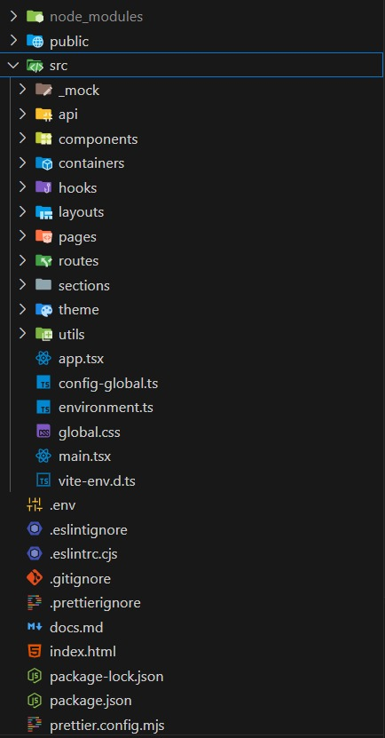

# 📘 Axios API Integration Guide

This repository is a **developer-friendly guide** for setting up **API integration in React/Next.js projects using Axios**.  
It includes best practices for **authentication, interceptors, environment configs, and reusable hooks**.

---

## 🚀 Features

- 🔗 Centralized **Axios instance** with base URL  
- 🛡️ **Request Interceptor** → Auto attach JWT tokens  
- 🔄 **Response Interceptor** → Auto logout on 401/403  
- 🔑 `useAuth` Hook → Manage user login, logout & session state  
- 🌍 Environment-based configuration (development/production)  
- ⚡ Ready-to-use in **React, Next.js, or Vite**  

---


## 📦 Project Structure

Here’s how the project is organized:



## 📦 Installation

```bash
git clone https://github.com/your-username/axios-api-integration-guide.git
cd axios-api-integration-guide
npm install

